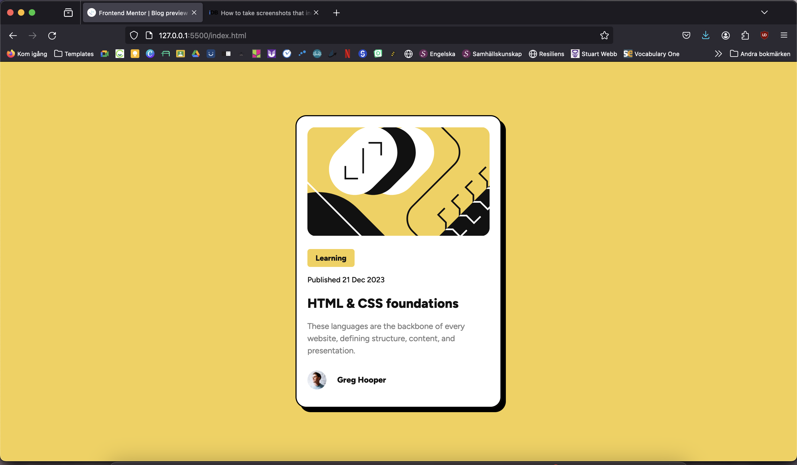
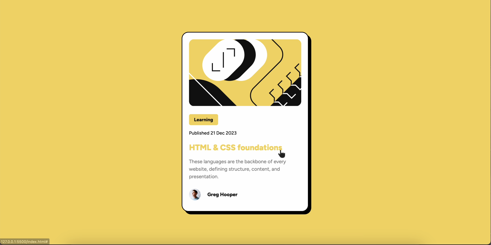

# Frontend Mentor - Blog preview card solution

This is a solution to the [Blog preview card challenge on Frontend Mentor](https://www.frontendmentor.io/challenges/blog-preview-card-ckPaj01IcS). Frontend Mentor challenges help you improve your coding skills by building realistic projects. 

## Table of contents

- [Overview](#overview)
  - [The challenge](#the-challenge)
  - [Screenshot](#screenshot)
  - [Links](#links)
- [My process](#my-process)
  - [Built with](#built-with)
  - [What I learned](#what-i-learned)
  - [Continued development](#continued-development)
  - [Useful resources](#useful-resources)
- [Author](#author)

## Overview

### The challenge

Users should be able to:

- See hover and focus states for all interactive elements on the page

### Screenshots





### Links

- Live Site URL: [Netlify](https://ruby-blog-preview-card.netlify.app/)

## My process

### Built with

- Semantic HTML5 markup
- CSS custom properties
- Flexbox

### What I learned

I learned about box-shadow, which was new to me. I mean I've seen it on webpages, but I've never tried it myself. So that was really cool.

I also learned about how to use an image as a pointer. I'm not sure that was how the challenge was suppose to be solved but it worked.

```css
a:hover {
    color: var(--primary);
    cursor: url('/assets/images/icons8-pointer-26.png'), auto;
}
```

### Continued development

I need to continue working with Flexbox and also margin and padding. I feel like I'm getting better and better at it, but I definitely need more practice. 

### Useful resources

- [Stack Overflow](https://stackoverflow.com/questions/18551277/using-external-images-for-css-custom-cursors) - This helped me with figuring out how to change the pointer when hovering over a link.
- [W3 Schools](https://www.w3schools.com/css/css3_shadows_box.asp) - This article helped me with the box-shadow property.

## Author

- Github - [Linda Jensen](https://github.com/lindajensen)
- Frontend Mentor - [@lindajensen](https://www.frontendmentor.io/profile/lindajensen)
- LinkedIn - [Linda Jensen](www.linkedin.com/in/linda-jensen-swe)

